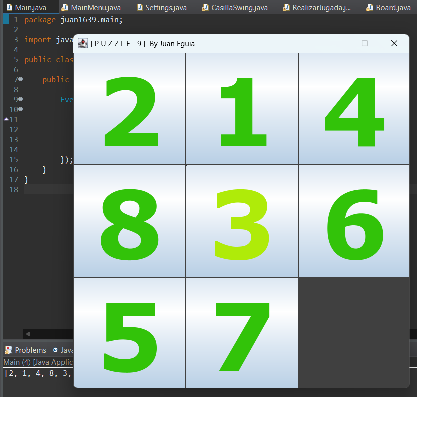

# Sencillo Juego tipo Puzzle en Java

# Estructura del Proyecto /src/

<ul>
	<li>main package</li>
	<ul>
		<li>Main.java</li>
		<li>MainMenu.java</li>
		<li>Settings.java</li>
	</ul>
	<li>tablero package</li>
	<ul>
		<li>Board.java</li>
	</ul>
	<li>logica package</li>
	<ul>
		<li>CheckPuzzleResueltoClass.java</li>
		<li>RealizarJugada.java</li>
	</ul>
	<li>entidades package</li>
	<ul>
		<li>CasillaSwing.java</li>
	</ul>
</ul>
